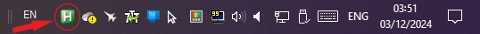

If you want to tap-fire or burst-fire with mouse left-clicks in a game that doesn't allow holding down the left mouse key for auto-fire, this macro below constantly simulates left-clicks 10 times a second. It activates when the ScrLk button is on (you can see its LED on your keyboard) and it stops when ScrLk is turned off. You can still move the mouse as usual and click on ScrLk to re-start and re-pause this macro as many times as you would like.
```AHK
#Persistent ; Keeps the script running
SetTimer, CheckScrLk, 100 ; Check every 100ms
return

CheckScrLk:
if GetKeyState("ScrollLock", "T") ; If Scroll Lock is toggled on
{
    Click ; Simulate a mouse click
    Sleep, 100 ; Add delay between clicks (adjust as needed)
}
return
```

Steps to use AutoHotkey (AHK) macros: 

1) Download AutoHotkey from: https://www.autohotkey.com

2) Click on 'New script' in AutoHotkey Dash and name it something nice.


3) Press Edit. Copy & paste the above script. It can be editted in Notepad or VS Code.

4) Double-click the green H icon in the right of the taskbar to activate the macro.

