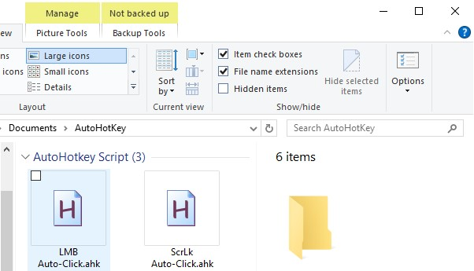
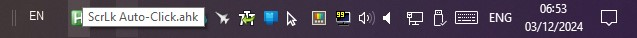

If you want to tap-fire or burst-fire with mouse left-clicks in a game that has infinite ammo but doesn't allow holding down the left mouse key for auto-fire, this macro below constantly simulates left-clicks 10 times a second. It activates when the ScrLk button is on (you can see its LED on your keyboard) and it stops when ScrLk is turned off. You can still move the mouse as usual and click on ScrLk to re-start and re-pause this macro as many times as you would like.
```AHK
#Persistent ; Keeps the script running
SetTimer, CheckScrLk, 10 ; Check every 10ms
return

CheckScrLk:
if GetKeyState("ScrollLock", "T") ; If Scroll Lock is toggled on
{
    Click ; Simulate a mouse click
    Sleep, 1 ; Add delay between clicks (adjust as needed)
}
return
```
Examples of flash games where this macro is useful are: Crusader Tank (games attached above)

---
Likewise, some games that only allow tap and burst fire have limited ammo or require reloading, so it's best to have a macro that simulates fast Left-Mouse Button (LMB) tapping simply by holding the LMB, as if the game allows for fully-automatic firing. The script below acomplishes this:
```AHK
$LButton:: ; Custom handler for the left mouse button
Loop
{
    if !GetKeyState("LButton", "P") ; If the button is released, exit the loop
        break
    Click ; Simulate a left mouse click
    Sleep, 1 ; Delay between simulated clicks (adjust as needed)
}
return
```
Examples of flash games where this macro is useful are: Crusader Tank, Miniclip's Commando Series (games attached above)

---
Steps to use AutoHotkey (AHK) macros: 

1) Download <a href="https://www.autohotkey.com" target="_blank" rel="noopener noreferrer">AutoHotkey</a>

2) Click on 'New script' in AutoHotkey Dash and name it something nice.


3) Press Edit. Copy & paste the above script. It can be editted in Notepad or VS Code.

4) Double-click the new .ahk file you created and saved in the folder it was saved.
  
This macro is activated when you can see the green H icon in the right of the taskbar.

You can right-click on this icon and press 'Exit' to quit the macro.

Hovering over it with the mouse cursor shows its name, in case you have multiple macros activated.


